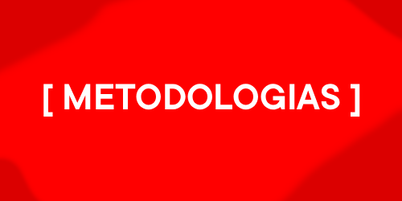
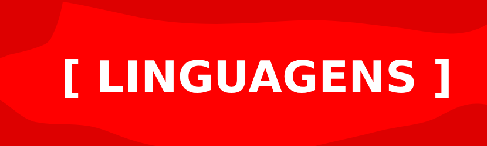

  
Sou um estudante de `segurança da informação`, com aptidão em **identificação e classificação de falhas**, **testes de intrusão em sistemas e redes**, `exploração de vulnerabilidades` e **avaliações técnicas em ambientes corporativos**, de forma objetiva e alinhada aos **objetivos do cliente**.

Atuo na `análise de riscos` e impactos, `elaboração de relatórios técnicos auditáveis` e possuo experiência em **linguagens de programação**, **criação de exploits** e **análise de código** nos modelos **white-box**, **gray-box** e **black-box testing**.

<h1 align="center">Perfil Técnico</h1>

<!-- Metodologias -->

  
  &nbsp;&nbsp;&nbsp;&nbsp;
  
  &nbsp;&nbsp;&nbsp;&nbsp;
  

 

 

  
  
  

  

 

 

  
  
  
  
  
  
  
  
  
  
  
  
  
  
  
  
  

  

<h2 align="center">📂 Projetos</h2>

  

    
    

  

  
  

